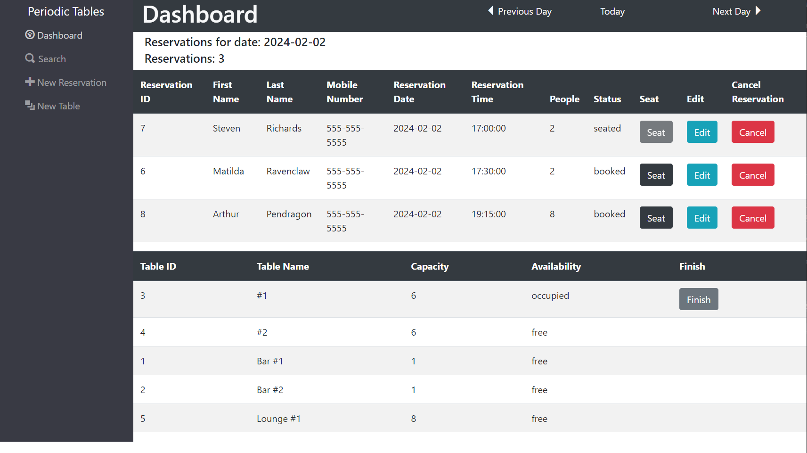
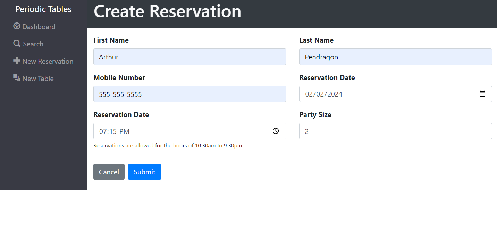
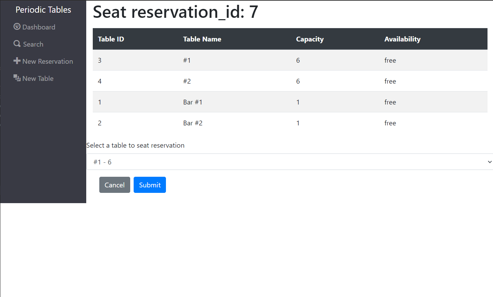
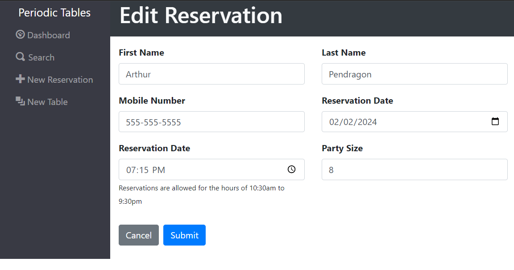
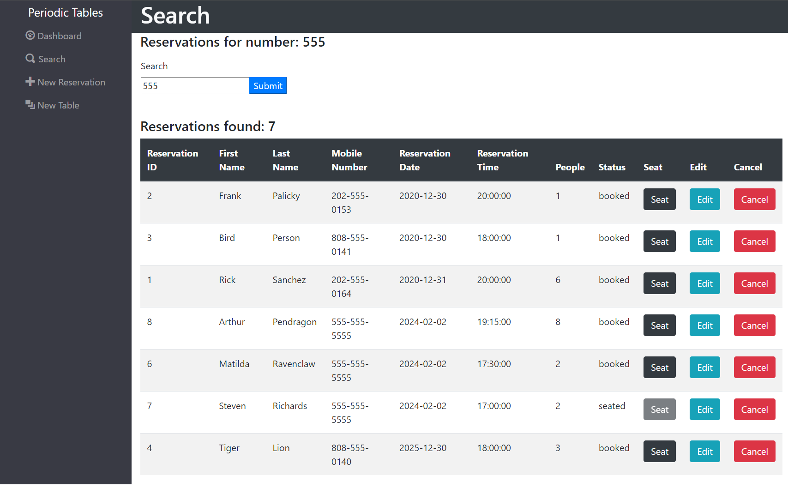
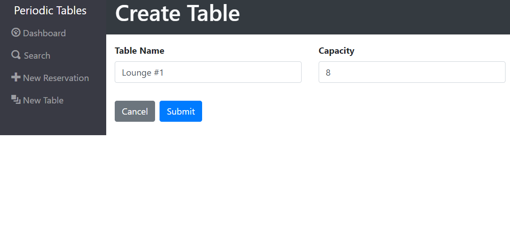
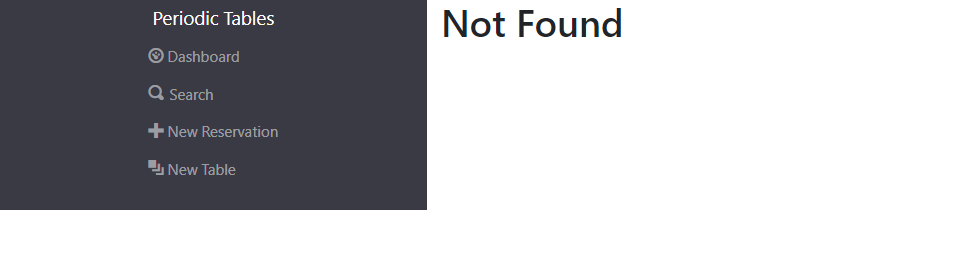
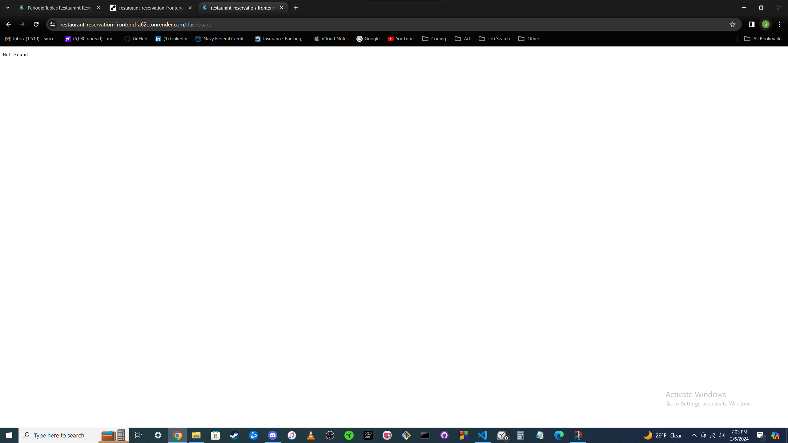

# Restaurant Reservation System

## Currently a work in progress.

Application is completed, but currently learning pupppetteer to update the tests.

## Purpose

An internal table and reservation management system for restaurants.

## Live Site

https://restaurant-reservation-frontend-a62q.onrender.com

## Instructions

### Installation

1. Fork and clone this repository.
1. Run `cp ./back-end/.env.sample ./back-end/.env`.
1. Update the `./back-end/.env` file with the connection URL's to your PostgreSQL database instance.
1. Run `cp ./front-end/.env.sample ./front-end/.env`.
1. Run `npm install` to install project dependencies.
1. Run `npm run start:dev` to start your server in development mode.

### Knex

Run `npx knex` commands from within the `back-end` folder, which is where the `knexfile.js` file is located.

### Running tests

This project has unit, integration, and end-to-end (e2e) tests.
End-to-end tests use browser automation to interact with the application just like the user does.

Test are split up. You can run the tests for a given set by running:

`npm run test:X` where `X` is the set number.

Have a look at the following examples:

- `npm run test:1` runs all the tests for set 1 (both frontend and backend).
- `npm run test:3:backend` runs only the backend tests for set 3.
- `npm run test:3:frontend` runs only the frontend tests for set 3.

> **Note** When running `npm run test:X` If the frontend tests fail, the tests will stop before running the backend tests. Remember, you can always run `npm run test:X:backend` or `npm run test:X:frontend` to target a specific part of the application.

You can run all tests by:

- `npm test` runs _all_ tests.
- `npm run test:backend` runs _all_ backend tests.
- `npm run test:frontend` runs _all_ frontend tests.
- `npm run test:e2e` runs only the end-to-end tests.

Note that the logging level for the backend is set to `warn` when running tests and `info` otherwise.

> **Note**: After running `npm test`, `npm run test:X`, or `npm run test:e2e` you might see something like the following in the output: `[start:frontend] Assertion failed:`. This is not a failure, it is just the frontend project getting shutdown automatically.

> **Note**: If you are getting a `unable to resolve dependency tree` error when running the frontend tests, run the following command: `npm install --force --prefix front-end`. This will allow you to run the frontend tests.

#### Screenshots

To help you better understand what might be happening during the end-to-end tests, screenshots are taken at various points in the test.

The screenshots are saved in `front-end/.screenshots` and you can review them after running the end-to-end tests.

You can use the screenshots to debug your code by rendering additional information on the screen.

## Description, Features, and Utilizing the UI

- An internal table and reservation management system for restaurants.

  - Each reservation includes sections for:

    - Reservation ID (generated automatically)
    - First and Last Name
    - Mobile Number
    - Reservation Date and Time
    - People (party size)
    - Status (Booked, Sat, Finished, Cancelled)
    - Actions to:
      - Seat
      - Edit
      - Cancel Reservation

  - Reservation utilization:

    - To create a reservation, click New Reservation on the sidebar.

    - To search for a reservation by Mobile Number, click Search on the sidebar, partial matches are allowed.

    - To edit, seat, or cancel a reservation; go to the date of the reservation in the dashboard or Search for it and click the relevant button.

    - To go to a date for it's list of reservations, you can either navigate through the previous day, today, or next day buttons on the dashboard or by entering the date in a query string in the URL through the following format: (domain name).com/dashboard?date=yyyy-mm-dd.

  - Each table includes sections for:

    - Table ID (generated automatically)
    - Table Name
    - Capacity
    - Availability
    - Action to Finish Table

  - Table utilization:

    - To create a table, click New Table on the sidebar.

    - To finish a table, go to the dashboard and click the 'Finish' button.

    - You can finish a table from any date on the dashboard.

## Improvements and Future

- Add a calendar to the dashboard that allows people to navigate dates more easily.
- Add the ability to delete and edit tables.
- Add the ability to seat, finish, or cancel a reservation from edit reservation.
- Due to the restaurant being closed on Tuesdays, some tests fail if performed on a Tuesday, primarily seating tests. Fix so testing can be performed any day.

## Technologies Used

- Backend:

  - Node, Express, Knex, Pino, Jest, cors

- Frontend:

  - Node, React, Pino, Jest

## Images of current app

#### Dashboard

#### Create Reservation

#### Seat Reservation

#### Edit Reservation

#### Search

#### Create Reservation

#### Not Found - App

#### Not Found - Render

